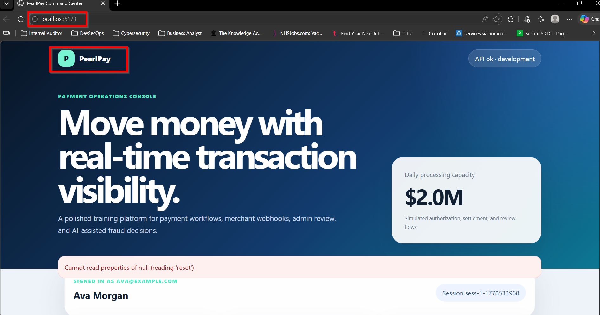
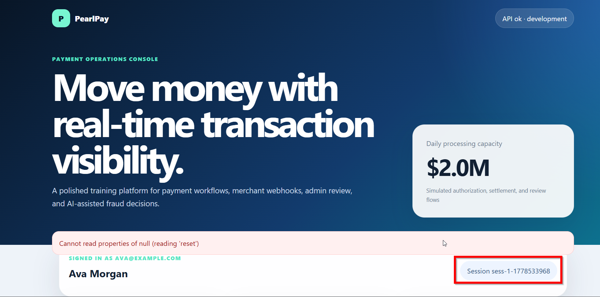
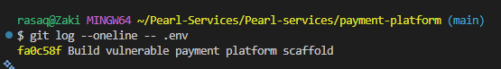

# Phase 1 — Project Setup & Threat Modelling

**Project:** PearlPay — Vulnerable Payment Processing Platform  
**Phase status:** ✅ Complete  
**Date completed:** 11 May 2026 
**Author:** Rasaq Bello

---

## Objective

Build a deliberately vulnerable payment processing platform simulating $2M in daily transactions. The goal is not to build secure software — it is to create a realistic target environment that covers the most common vulnerability classes found in real fintech applications, so they can be identified, triaged, and remediated in later phases.

---

## What is PearlPay?

PearlPay is a simulated payment operations platform with the following capabilities:

| Feature | Description |
|---|---|
| User authentication | Registration, login, session management |
| Payment processing | Card submission, authorisation, settlement simulation |
| Transaction history | Per-user transaction ledger |
| Admin dashboard | Full transaction visibility across all users |
| Fraud detection | AI-assisted flagging via LLM integration |
| Merchant webhooks | Outbound notifications on payment outcomes |
| REST API | Consumed by the frontend and mock third-party merchants |

---

## Tech Stack

| Layer | Technology |
|---|---|
| Backend | Python (FastAPI) |
| Frontend | React |
| Database | PostgreSQL |
| Cache | Redis |
| Containerisation | Docker + Docker Compose |
| Orchestration | Kubernetes (manifests in `/k8s`) |
| Infrastructure as Code | Terraform (targeting AWS) |
| CI/CD | GitHub Actions |

---

## Architecture Overview

```
┌─────────────────────────────────────────────────────┐
│                     Internet                        │
└──────────────────────┬──────────────────────────────┘
                       │
              ┌────────▼────────┐
              │  React Frontend  │  :5173
              └────────┬────────┘
                       │ HTTP (no TLS in dev)
              ┌────────▼────────┐
              │  FastAPI Backend │  :8000
              └──┬──────────┬───┘
                 │          │
       ┌─────────▼──┐  ┌────▼──────┐
       │ PostgreSQL  │  │   Redis   │
       │  (no SSL)   │  │ (no auth) │
       └─────────────┘  └───────────┘
```

> ⚠️ No TLS, no network segmentation, no authentication between services.  
> This is intentional for training purposes.

---

## Vulnerabilities Introduced

These were deliberately built into the application. Each one is tagged in the source code with a `// VULN:` comment.

### Application Layer (OWASP Top 10)

| ID | Vulnerability | Severity | Location | VULN Tag |
|---|---|---|---|---|
| A-01 | SQL Injection | Critical | Login + transaction search | `VULN: SQL_INJECTION` |
| A-02 | Broken Authentication — no rate limiting | High | `/api/auth/login` | `VULN: BROKEN_AUTH` |
| A-03 | Broken Authentication — weak JWT secret | High | `config.py` | `VULN: WEAK_JWT` |
| A-04 | IDOR — transactions readable by any user | High | `/api/transactions/{id}` | `VULN: IDOR` |
| A-05 | Stored XSS — merchant name unescaped | High | Admin dashboard | `VULN: XSS` |
| A-06 | Security misconfiguration — debug mode on | Medium | `main.py` | `VULN: DEBUG_MODE` |
| A-07 | Security misconfiguration — CORS wildcard | Medium | `main.py` | `VULN: CORS` |
| A-08 | Broken Access Control — admin via query param | Critical | `/api/admin/*` | `VULN: BROKEN_ACCESS` |
| A-09 | Sensitive data exposure — plaintext card data | Critical | `/api/transactions` | `VULN: SENSITIVE_DATA` |
| A-10 | Mass assignment — role field accepted at registration | High | `/api/auth/register` | `VULN: MASS_ASSIGNMENT` |

### API Security

| ID | Vulnerability | Severity |
|---|---|---|
| API-01 | No input validation on payment submission | High |
| API-02 | No authentication on webhook endpoint | High |
| API-03 | Verbose error messages exposing DB schema | Medium |

### Secret Management

| ID | Vulnerability | Severity | Location |
|---|---|---|---|
| S-01 | Hardcoded database credentials | Critical | `config.py` |
| S-02 | Hardcoded JWT secret (`secret123`) | Critical | `config.py` |
| S-03 | Hardcoded AI API key | Critical | `config.py` |
| S-04 | Dummy AWS credentials in source | Critical | `config.py` |
| S-05 | `.env` file committed to git | High | `/.env` |

### AI / LLM Security

| ID | Vulnerability | Severity |
|---|---|---|
| AI-01 | Raw user input passed to LLM prompt (prompt injection) | High |
| AI-02 | System prompt exposed in API response | Medium |
| AI-03 | LLM output rendered to UI without validation | High |

### Kubernetes Misconfigurations

| ID | Vulnerability | Severity |
|---|---|---|
| K8S-01 | Pods running as root (`runAsUser: 0`) | High |
| K8S-02 | Privileged containers (`privileged: true`) | Critical |
| K8S-03 | No resource limits defined | Medium |
| K8S-04 | Default service account used for all pods | Medium |
| K8S-05 | Secrets stored as base64 only (not encrypted at rest) | High |
| K8S-06 | Admin dashboard exposed via LoadBalancer, no NetworkPolicy | High |

### Terraform / IaC Misconfigurations

| ID | Vulnerability | Severity |
|---|---|---|
| TF-01 | S3 bucket with public read ACL | Critical |
| TF-02 | RDS instance publicly accessible | Critical |
| TF-03 | Security group open on all ports to 0.0.0.0/0 | Critical |
| TF-04 | IAM role with AdministratorAccess on EKS nodes | Critical |
| TF-05 | RDS storage encryption disabled | High |
| TF-06 | Deployed into default VPC | Medium |

### CI/CD Pipeline

| ID | Vulnerability | Severity |
|---|---|---|
| CI-01 | Environment variables printed in build logs | High |
| CI-02 | No secret scanning step | High |
| CI-03 | No SAST or dependency scanning | High |
| CI-04 | Direct deploy to production on every push to main | High |
| CI-05 | AWS credentials hardcoded in workflow file | Critical |

---

## Evidence

### App running locally

<!-- Add a screenshot of http://localhost:5173 here -->
> Screenshot: 

### Session token exposed in UI

<!-- Add screenshot showing sess-1-XXXXXXXXX visible on the homepage -->
> Screenshot: 

### .env committed to git

```
# Confirm with:
git log --oneline
cat .env
```

Screenshot: 

---

## What I Learned

1. **Threat modelling before building** — even when building something intentionally broken, mapping out the vulnerability categories first gave me a mental model of where attackers look in a real payment system.

2. **Vulnerabilities are often architectural, not just code bugs** — things like IDOR and broken access control aren't typos, they're design decisions that were made wrong. That changes how you think about fixing them.

3. **Infrastructure is attack surface too** — before this project I thought of security as "secure the app code." The Terraform and Kubernetes misconfigs showed me that a perfectly written app can still be fully compromised through the infrastructure around it.

---

## Next Phase

[Phase 2 — SAST Scanning with Semgrep →](../phase-2-sast/README.md)

---

## Resources

- [OWASP Top 10](https://owasp.org/www-project-top-ten/)
- [CVSS Score Calculator](https://www.first.org/cvss/calculator/3.1)
- [Semgrep Rules Registry](https://semgrep.dev/r)
- [CWE Vulnerability Database](https://cwe.mitre.org/)
