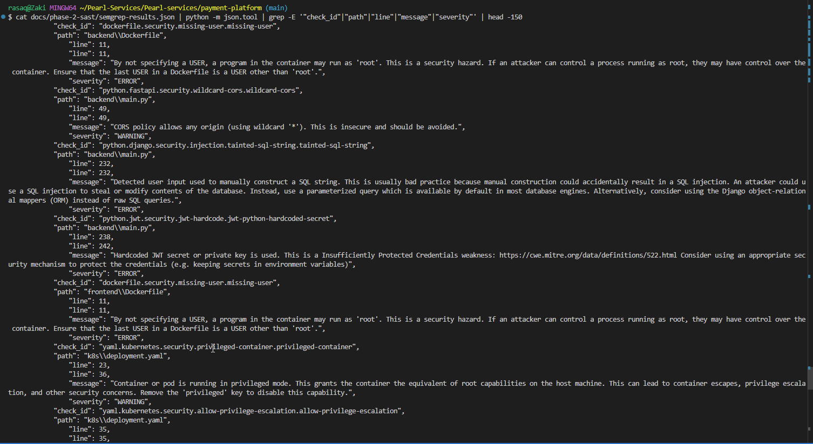
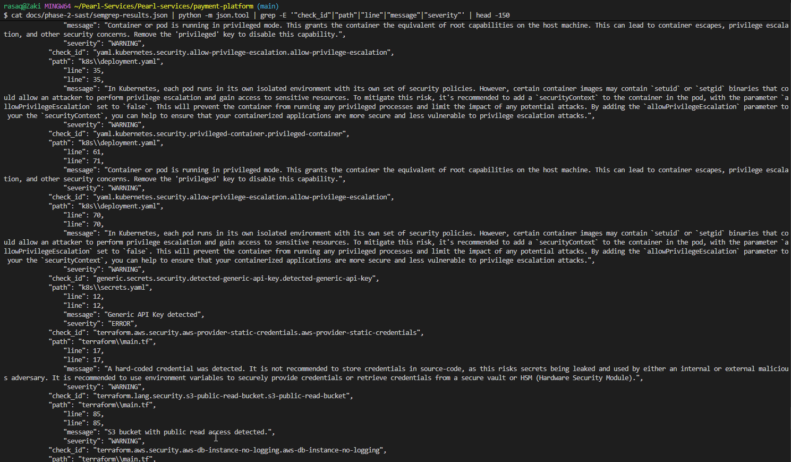
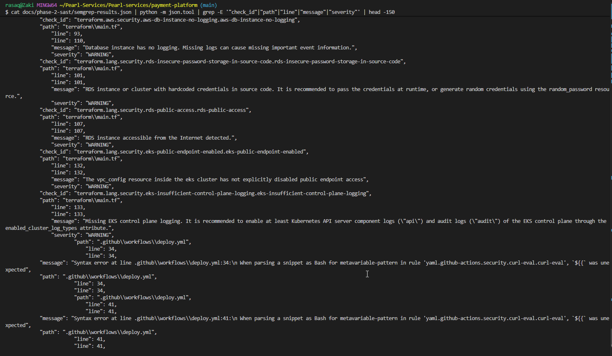

# Phase 2 — SAST Scanning with Semgrep

**Tool:** Semgrep OSS v1.162.0  
**Rules run:** 595  
**Files scanned:** 25  
**Total findings:** 17 (17 blocking)  
**Scan date:** 12 May 2026  
**Author:** Rasaq Bello

---

## Objective

Run static application security testing (SAST) against the PearlPay codebase to automatically identify vulnerable code patterns, misconfigurations, and hardcoded secrets — without executing the application.

---

## What is SAST?

Static Application Security Testing analyses source code at rest. The tool reads your code the same way a security engineer would during a code review, but at scale — running hundreds of rules in seconds. It does not run the application or send any network requests.

**Advantages:**
- Finds issues early, before deployment
- Fast feedback loop for developers
- Catches secrets, injection flaws, and misconfigurations automatically

**Limitations:**
- Cannot find runtime vulnerabilities (e.g. broken authentication flows, business logic flaws)
- Can produce false positives — every finding must be manually triaged
- Free OSS tier misses deeper dataflow analysis (requires Semgrep Code)

---

## How the Scan Was Run

```bash
semgrep scan --config=auto --output=docs/phase-2-sast/semgrep-results.json --json
```

The `--config=auto` flag tells Semgrep to detect the languages in the repo and automatically apply the relevant community security ruleset. In this case it detected Python, JavaScript/React, Dockerfile, Kubernetes YAML, Terraform HCL, and GitHub Actions YAML.

---

## Findings — Full Triage Table

| ID | Rule | File | Line | Severity | CVSS | Priority | Verdict | Vulnerability Class |
|---|---|---|---|---|---|---|---|---|
| F-01 | missing-user | `backend/Dockerfile` | 11 | ERROR | 7.0 | P2 | ✅ True Positive | Container runs as root |
| F-02 | missing-user | `frontend/Dockerfile` | 11 | ERROR | 7.0 | P2 | ✅ True Positive | Container runs as root |
| F-03 | wildcard-cors | `backend/main.py` | 49 | WARNING | 6.5 | P2 | ✅ True Positive | Security Misconfiguration |
| F-04 | tainted-sql-string | `backend/main.py` | 232 | ERROR | 9.8 | P1 | ✅ True Positive | SQL Injection |
| F-05 | jwt-hardcoded-secret | `backend/main.py` | 238 | ERROR | 8.1 | P1 | ✅ True Positive | Hardcoded Credential |
| F-06 | privileged-container | `k8s/deployment.yaml` | 23 | WARNING | 8.8 | P1 | ✅ True Positive | Privilege Escalation |
| F-07 | allow-privilege-escalation | `k8s/deployment.yaml` | 35 | WARNING | 7.8 | P1 | ✅ True Positive | Privilege Escalation |
| F-08 | privileged-container | `k8s/deployment.yaml` | 61 | WARNING | 8.8 | P1 | ✅ True Positive | Privilege Escalation |
| F-09 | allow-privilege-escalation | `k8s/deployment.yaml` | 70 | WARNING | 7.8 | P1 | ✅ True Positive | Privilege Escalation |
| F-10 | detected-generic-api-key | `k8s/secrets.yaml` | 12 | ERROR | 9.1 | P1 | ✅ True Positive | Secret Exposure |
| F-11 | aws-provider-static-credentials | `terraform/main.tf` | 17 | WARNING | 9.1 | P1 | ✅ True Positive | Hardcoded AWS Credentials |
| F-12 | s3-public-read-bucket | `terraform/main.tf` | 85 | WARNING | 7.5 | P1 | ✅ True Positive | Public Cloud Storage |
| F-13 | aws-db-instance-no-logging | `terraform/main.tf` | 93 | WARNING | 5.3 | P3 | ✅ True Positive | Missing Audit Logging |
| F-14 | rds-insecure-password-storage | `terraform/main.tf` | 101 | WARNING | 9.1 | P1 | ✅ True Positive | Hardcoded DB Credentials |
| F-15 | rds-public-access | `terraform/main.tf` | 107 | WARNING | 9.8 | P1 | ✅ True Positive | Public Database Exposure |
| F-16 | eks-public-endpoint-enabled | `terraform/main.tf` | 132 | WARNING | 8.1 | P1 | ✅ True Positive | Public K8s API Server |
| F-17 | eks-insufficient-logging | `terraform/main.tf` | 133 | WARNING | 5.3 | P3 | ✅ True Positive | Missing Audit Logging |

> **Note:** Two parse errors appeared in `.github/workflows/deploy.yml` (lines 34 and 41). These are Semgrep false errors caused by GitHub Actions `${{ }}` syntax confusing the Bash parser. They are not security findings — marked as false positives and excluded from the count.

---

## Triage Summary

| Priority | Count | Rationale |
|---|---|---|
| P1 — Fix immediately | 11 | Direct exploitability, data exposure, or full system compromise possible |
| P2 — Fix this sprint | 3 | Significant risk but requires additional conditions to exploit |
| P3 — Fix next sprint | 2 | Defence-in-depth, no direct exploitability but weakens forensic capability |

| Verdict | Count |
|---|---|
| True Positive | 17 |
| False Positive | 0 |
| Parse Error (excluded) | 2 |

---

## Critical Findings — Deep Dive

### F-04 — SQL Injection (`backend/main.py:232`)
**CVSS: 9.8 — Critical**

User input is concatenated directly into a SQL query string. An attacker can inject malicious SQL to dump the entire database, bypass authentication, or delete records.

**Vulnerable pattern:**
```python
# VULN: SQL_INJECTION
query = f"SELECT * FROM transactions WHERE user_id = '{user_id}' AND merchant = '{merchant}'"
```

**Impact:** Full database compromise. In a payment platform this means access to all card numbers, transaction history, and user credentials.

**Fix (Phase 4):** Replace with parameterised queries using SQLAlchemy or asyncpg bound parameters.

---

### F-05 — Hardcoded JWT Secret (`backend/main.py:238`)
**CVSS: 8.1 — High**

The secret used to sign and verify JWT authentication tokens is hardcoded as `secret123`. Anyone who reads the source code can forge valid tokens for any user account including admins.

**Impact:** Complete authentication bypass. An attacker can create a token for `admin@pearlpay.com` without knowing the password.

**Fix (Phase 4):** Load secret from environment variable, rotate the secret, invalidate all existing tokens.

---

### F-10 — API Key in Kubernetes Secret (`k8s/secrets.yaml:12`)
**CVSS: 9.1 — Critical**

API keys stored in Kubernetes Secrets are only base64 encoded, not encrypted. Anyone with kubectl access or read permissions on the secrets resource can decode them instantly.

```bash
# Any attacker with cluster access can run:
kubectl get secret pearlpay-secrets -o jsonpath='{.data.api-key}' | base64 -d
```

**Fix (Phase 6):** Integrate HashiCorp Vault with the External Secrets Operator to inject secrets at runtime rather than storing them in the cluster.

---

### F-15 — RDS Publicly Accessible (`terraform/main.tf:107`)
**CVSS: 9.8 — Critical**

The PostgreSQL database is configured with `publicly_accessible = true`, meaning it is reachable directly from the internet on port 5432. Combined with the hardcoded credentials in F-14, this means anyone on the internet can connect to the database directly.

**Fix (Phase 5):** Set `publicly_accessible = false`, place RDS in a private subnet, and restrict access via security group to the EKS node group only.

---

## Evidence

Screenshot: 



---

## What I Learned

1. **SAST finds patterns, not proofs** — Semgrep flags code that matches a vulnerable pattern. It cannot always confirm whether the vulnerability is actually reachable or exploitable. That's why manual triage is essential — every finding needs a human to assess context.

2. **Infrastructure code is source code** — Semgrep scanned Terraform, Kubernetes YAML, and Dockerfiles just like Python. Security misconfigurations in IaC are just as dangerous as application vulnerabilities and need to be in the same review pipeline.

3. **CVSS scoring changes how you prioritise** — not all ERRORs are equal. A missing log (F-13, CVSS 5.3) and a publicly accessible database (F-15, CVSS 9.8) are both flagged as warnings by Semgrep, but they are worlds apart in real-world impact. Learning to apply CVSS scores is what separates triaging from just copy-pasting tool output.

4. **Free tier limitations are real** — Semgrep OSS missed 1,738 pro rules. In a real engagement you would use Semgrep Code or supplement with additional tools (Bandit for Python, ESLint security plugin for JS). No single tool covers everything.

---

## Raw Scan Output

Full JSON results: [`semgrep-results.json`](./semgrep-results.json)

---

## Next Phase

[Phase 3 — DAST Scanning with OWASP ZAP →](../phase-3-dast/README.md)

---

## Resources

- [Semgrep Rules Registry](https://semgrep.dev/r)
- [CVSS v3.1 Calculator](https://www.first.org/cvss/calculator/3.1)
- [CWE-89: SQL Injection](https://cwe.mitre.org/data/definitions/89.html)
- [CWE-522: Insufficiently Protected Credentials](https://cwe.mitre.org/data/definitions/522.html)
- [OWASP Testing Guide — SAST](https://owasp.org/www-project-web-security-testing-guide/)
