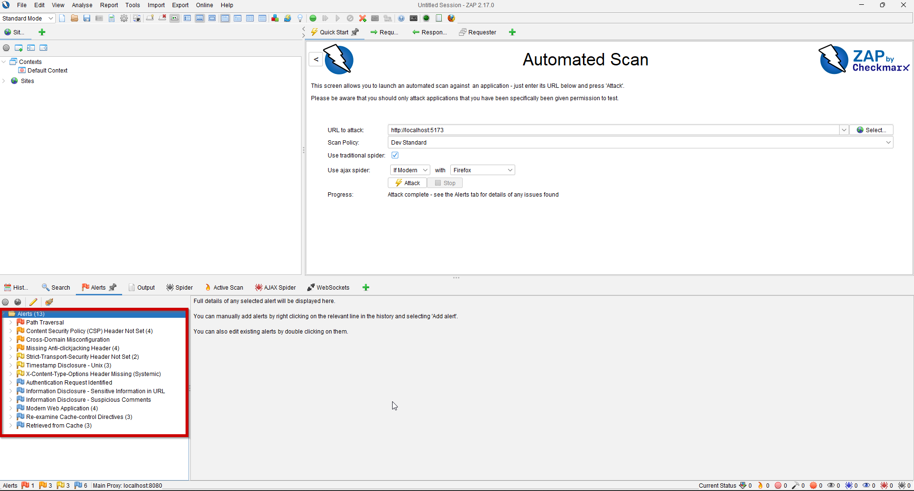
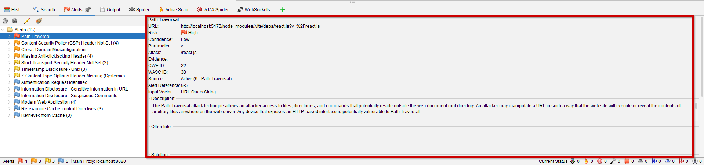
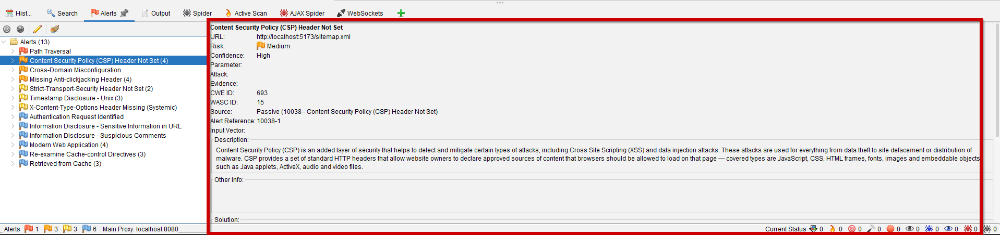

# Phase 3 — DAST Scanning with OWASP ZAP

**Tool:** OWASP ZAP (Zed Attack Proxy) by Checkmarx  
**Target:** http://localhost:5173 (Frontend) + http://localhost:8000 (API)  
**Total alerts:** 13  
**Scan date:** 13 May 2026
**Author:** Rasaq Bello

---

## Objective

Run Dynamic Application Security Testing (DAST) against the running PearlPay application to find vulnerabilities that only appear at runtime — things SAST cannot see, such as missing HTTP security headers, information disclosure, and active injection attempts.

---

## What is DAST?

Dynamic Application Security Testing attacks a **running application** from the outside, the same way a real attacker would. Unlike SAST which reads source code, DAST sends real HTTP requests — including malicious payloads — and analyses the responses.

**Advantages over SAST:**
- Finds runtime vulnerabilities invisible in source code
- Confirms whether a vulnerability is actually exploitable
- Tests the full stack — web server, framework, headers, and responses
- No access to source code required (black-box testing)

**Limitations:**
- Struggles with modern JavaScript SPAs (React, Vue) — the spider cannot fully crawl dynamic content
- Cannot find logic flaws or code-level issues
- Authenticated scanning requires additional configuration
- AJAX spider using a real browser (Firefox) can accidentally scan browser background requests unrelated to the target application

---

## How the Scan Was Run

1. Started PearlPay with `docker-compose up -d`
2. Opened OWASP ZAP and selected **Automated Scan**
3. Set target URL to `http://localhost:5173`
4. Enabled traditional spider + AJAX spider with Firefox
5. Scan policy: Dev Standard
6. Clicked **Attack** and waited for completion

---

## Findings — Full Triage Table

| ID | Alert | URL | Risk | Confidence | CVSS | Priority | Verdict |
|---|---|---|---|---|---|---|---|
| D-01 | Path Traversal | `localhost:5173/node_modules/.vite/deps/react.js?v=%2Freact.js` | High | Low | N/A | ❌ False Positive | Firefox/Vite dev server artefact |
| D-02 | CSP Header Not Set | `localhost:5173/sitemap.xml` | Medium | High | 6.1 | P2 | ✅ True Positive |
| D-03 | Cross-Domain Misconfiguration | `firefox.settings.services.mozilla.com` | Medium | Medium | N/A | ❌ False Positive | Mozilla internal URL — not PearlPay |
| D-04 | Missing Anti-Clickjacking Header | `localhost:5173/sitemap.xml` | Medium | Medium | 6.1 | P2 | ✅ True Positive |
| D-05 | Strict-Transport-Security Header Not Set | `firefox-settings-attachments.cdn.mozilla.net` | Low | High | N/A | ❌ False Positive | Mozilla internal URL — not PearlPay |
| D-06 | Timestamp Disclosure - Unix | `firefox-settings-attachments.cdn.mozilla.net` | Low | Low | N/A | ❌ False Positive | Mozilla internal URL — not PearlPay |
| D-07 | X-Content-Type-Options Header Missing | `localhost:8000/api/health` | Low | Medium | 4.3 | P3 | ✅ True Positive |
| D-08 | Authentication Request Identified | `localhost:5173` | Informational | Medium | N/A | P3 | ✅ True Positive |
| D-09 | Information Disclosure - Sensitive Info in URL | `localhost:5173` | Informational | Medium | 5.3 | P2 | ✅ True Positive |
| D-10 | Information Disclosure - Suspicious Comments | `localhost:5173` | Informational | Low | 3.7 | P3 | ✅ True Positive |
| D-11 | Modern Web Application | `localhost:5173` | Informational | Medium | N/A | — | ℹ️ Informational only |
| D-12 | Re-examine Cache-control Directives | `localhost:5173` | Informational | Low | 3.7 | P3 | ✅ True Positive |
| D-13 | Retrieved from Cache | `localhost:5173` | Informational | Medium | N/A | — | ℹ️ Informational only |

---

## Triage Summary

| Severity | Count |
|---|---|
| 🔴 High | 1 |
| 🟠 Medium | 3 |
| 🟡 Low | 3 |
| 🔵 Informational | 6 |

| Verdict | Count | Findings |
|---|---|---|
| ✅ True Positive | 7 | D-02, D-04, D-07, D-08, D-09, D-10, D-12 |
| ❌ False Positive | 4 | D-01, D-03, D-05, D-06 |
| ℹ️ Informational only | 2 | D-11, D-13 |

> **Nearly half the findings were false positives.** This is a known limitation of AJAX spidering with a real browser — ZAP launched Firefox which made background requests to Mozilla's own services, and ZAP scanned those too. Always verify the URL of every finding before acting on it.

---

## False Positive Analysis

### Why 4 findings were false positives

**D-01 — Path Traversal**
ZAP detected `%2F` (URL-encoded `/`) in the query parameter `?v=%2Freact.js` and flagged it as a path traversal attack. In reality this URL is generated by **Vite's development server** for JavaScript module resolution. The `%2F` is Vite's internal syntax, not an attacker navigating file paths. Confirmed false positive because:
- URL is on `localhost:5173` (Vite dev server), not the API
- `node_modules/.vite/deps/` is a standard Vite cache directory
- Confidence rating was **Low** — ZAP itself was not confident
- Response serves a legitimate JavaScript file, not system files

**D-03, D-05, D-06 — Mozilla Firefox Internal Requests**
ZAP's AJAX spider works by launching a real Firefox browser and recording all HTTP traffic. Firefox makes background requests to Mozilla's own services (settings sync, tracking protection lists, etc.) during normal operation. ZAP captured these requests and scanned them as if they were part of PearlPay.

The domains `firefox.settings.services.mozilla.com` and `firefox-settings-attachments.cdn.mozilla.net` are owned and operated by Mozilla — not by PearlPay. Any findings against these URLs are irrelevant to this assessment.

**Lesson:** When using AJAX spidering, always scope your scan to your target domain only. In ZAP this is done by setting a **Context** with an include pattern like `http://localhost:5173.*` to prevent the scanner following external URLs.

---

## True Positive Deep Dives

### D-02 — Content Security Policy Header Not Set
**CVSS: 6.1 — Medium | URL: localhost:5173/sitemap.xml**

The application returns no `Content-Security-Policy` header on any response. CSP tells browsers which sources of scripts, styles, and images are trusted. Without it, any injected script — such as the stored XSS vulnerability found in Phase 2 (A-05) — will execute freely in the victim's browser with no browser-level defence.

**This finding directly amplifies A-05 from Phase 2.** XSS is significantly more dangerous without CSP in place.

**Fix (Phase 4):**
```python
response.headers["Content-Security-Policy"] = "default-src 'self'"
```

---

### D-04 — Missing Anti-Clickjacking Header
**CVSS: 6.1 — Medium | URL: localhost:5173/sitemap.xml**

No `X-Frame-Options` or `frame-ancestors` CSP directive is set. An attacker can embed the PearlPay payment page inside a transparent iframe on a malicious website. A victim thinks they are clicking a button on the attacker's page but is actually clicking the payment confirmation button on PearlPay — this is a **clickjacking attack**.

In a payment platform this could trigger unauthorised transactions without the victim's knowledge.

**Fix (Phase 4):**
```python
response.headers["X-Frame-Options"] = "DENY"
```

---

### D-07 — X-Content-Type-Options Header Missing
**CVSS: 4.3 — Medium | URL: localhost:8000/api/health**

The API returns no `X-Content-Type-Options: nosniff` header. Without this, browsers may attempt to guess (sniff) the content type of a response rather than trusting the declared `Content-Type`. An attacker who can influence a response body could trick the browser into executing it as a different content type — for example, treating a JSON response as JavaScript.

**Fix (Phase 4):**
```python
response.headers["X-Content-Type-Options"] = "nosniff"
```

---

## SAST vs DAST — What Each Tool Found

| Vulnerability | Found by SAST | Found by DAST | Notes |
|---|---|---|---|
| SQL Injection | ✅ F-04 | ❌ | DAST spider didn't reach authenticated API endpoints |
| Hardcoded JWT secret | ✅ F-05 | ❌ | Requires authenticated scan |
| CORS wildcard | ✅ F-03 | ❌ FP | D-03 was a Mozilla false positive |
| Missing CSP header | ❌ | ✅ D-02 | Headers only visible at runtime |
| Clickjacking | ❌ | ✅ D-04 | Headers only visible at runtime |
| X-Content-Type-Options | ❌ | ✅ D-07 | Headers only visible at runtime |
| Container running as root | ✅ F-01 | ❌ | Infrastructure finding, not HTTP |
| Privileged K8s pods | ✅ F-06/07 | ❌ | Infrastructure finding, not HTTP |

**Key insight:** SAST and DAST are complementary — neither tool alone gives the full picture. A mature security programme runs both on every deployment.

---

## DAST Limitation — Authenticated Scanning

ZAP scanned PearlPay as an **unauthenticated user**. This means it never reached:
- The payment submission endpoint
- The transaction history API (IDOR vulnerability A-04)
- The admin dashboard (broken access control A-08)
- The fraud detection AI endpoint (AI-01, AI-02)

A full DAST assessment would require configuring ZAP with a valid session token to scan authenticated endpoints. This is documented as a known gap in this phase's coverage.

---

## Evidence





Full HTML report: [`zap-report.html`](./zap-report.html)

---

## What I Learned

1. **Always check the URL before acting on a finding** — four of thirteen alerts were false positives, three of which were caused by ZAP scanning Mozilla's internal Firefox services. A High severity finding against a domain you don't own is not your vulnerability to fix. The URL is the first thing to check.

2. **AJAX spidering needs scoping** — ZAP's AJAX spider launches a real browser which makes background requests to external services. Without scoping the scan to your target domain, you will scan the internet. In production use, always set a ZAP Context with an include pattern to constrain the scan.

3. **DAST complements SAST — they find different things** — SAST found SQL injection and hardcoded secrets that DAST missed entirely. DAST found missing HTTP security headers that SAST never could. Neither tool alone is sufficient.

4. **Unauthenticated scanning has significant gaps** — the most dangerous vulnerabilities in PearlPay (IDOR, broken access control, payment manipulation) sit behind authentication and were completely missed by this scan. Authenticated DAST is a more advanced technique for later phases.

5. **False positive rate matters** — 4 out of 13 findings (31%) were false positives. In a real security programme, a high false positive rate erodes developer trust in the security team. Learning to triage accurately and only escalate confirmed findings is as important as finding vulnerabilities in the first place.

---

## Next Phase

[Phase 4 — Vulnerability Remediation →](../phase-4-remediation/README.md)

---

## Resources

- [OWASP ZAP Documentation](https://www.zaproxy.org/docs/)
- [OWASP ZAP — Scoping with Contexts](https://www.zaproxy.org/docs/desktop/start/features/contexts/)
- [Content Security Policy Reference](https://developer.mozilla.org/en-US/docs/Web/HTTP/CSP)
- [Clickjacking Defence Cheat Sheet](https://cheatsheetseries.owasp.org/cheatsheets/Clickjacking_Defense_Cheat_Sheet.html)
- [CVSS v3.1 Calculator](https://www.first.org/cvss/calculator/3.1)
