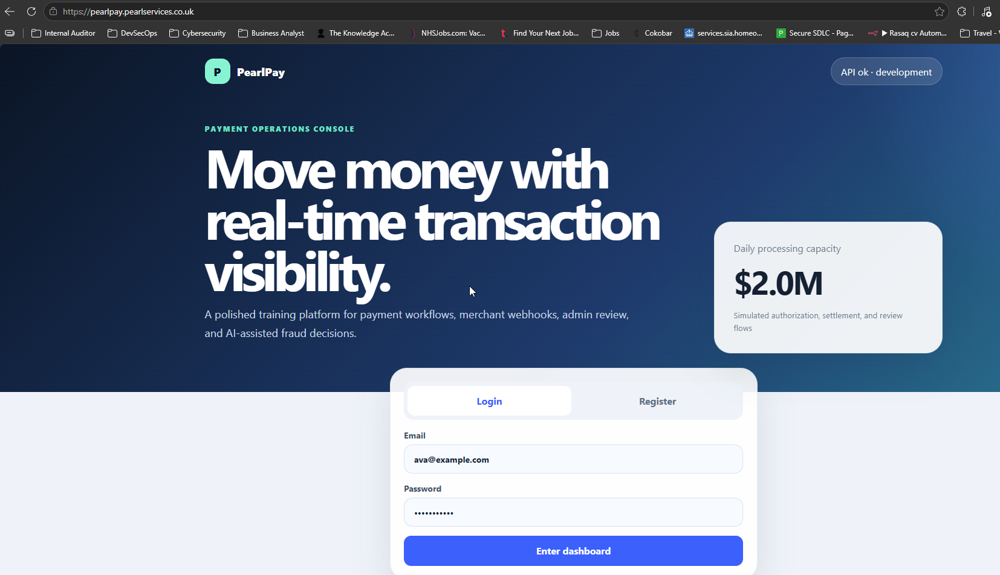
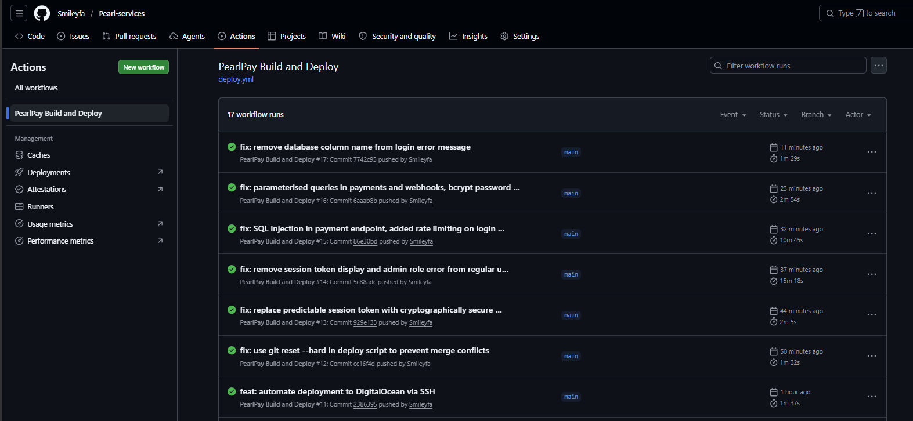
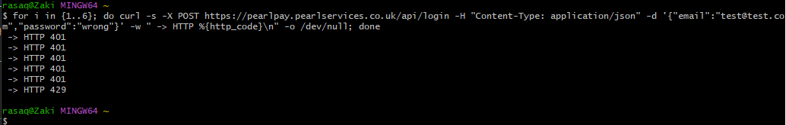
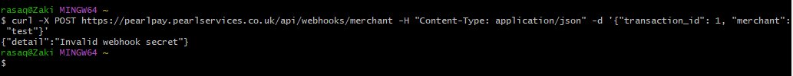

# Phase 9 — Live Deployment

**Phase status:** ✅ Complete  
**Live URL:** https://pearlpay.pearlservices.co.uk  
**Hosting:** DigitalOcean ($6/month droplet)  
**CDN + WAF:** Cloudflare (free)  
**Date completed:** 8 June 2026
**Author:** Rasaq Bello

---

## Objective

Deploy PearlPay to a production environment with a real domain, HTTPS, WAF protection (missing), and a fully automated CI/CD pipeline. Complete the remaining vulnerability remediations and verify the hardened application is live and accessible.

---

## Architecture

```
User browser
     ↓
https://pearlpay.pearlservices.co.uk
     ↓
Cloudflare (DDoS + TLS termination)
     ↓
DigitalOcean Droplet 167.172.59.75
     ↓
Nginx (reverse proxy on port 80)
     ↓
Docker Compose
  ├── Frontend (Vite/React) :5173
  ├── Backend (FastAPI) :8000
  ├── PostgreSQL :5432
  ├── Redis :6379
  └── HashiCorp Vault :8200
```

---

## Infrastructure

### DigitalOcean Droplet
- **Plan:** Basic — $6/month
- **Region:** London (LON1)
- **OS:** Ubuntu 24.04
- **IP:** 167.172.59.75
- **Authentication:** SSH key (GitHub Actions deploy key)

### Cloudflare
- **Domain:** pearlservices.co.uk
- **DNS Record:** A record — pearlpay → 167.172.59.75 (Proxied)
- **SSL Mode:** Flexible (Cloudflare handles HTTPS, nginx serves HTTP internally)
- **DDoS protection:** Enabled by default on all proxied records

### Nginx
Reverse proxy installed on the Droplet routing traffic to Docker containers:
- `/` → `http://localhost:5173` (frontend)
- `/api/` → `http://localhost:8000` (backend)

---

## Deployment Process

### Initial setup

```bash
# SSH into Droplet
ssh root@167.172.59.75

# Install Docker
curl -fsSL https://get.docker.com | sh

# Clone repository
git clone https://github.com/Smileyfa/Pearl-services.git
cd Pearl-services/payment-platform

# Start application
docker compose up -d --build
```

### Install nginx reverse proxy

```bash
apt-get install -y nginx

cat > /etc/nginx/sites-available/pearlpay << 'EOF'
server {
    listen 80;
    server_name pearlpay.pearlservices.co.uk;

    location / {
        proxy_pass http://localhost:5173;
        proxy_set_header Host $host;
        proxy_set_header X-Real-IP $remote_addr;
    }

    location /api/ {
        proxy_pass http://localhost:8000;
        proxy_set_header Host $host;
        proxy_set_header X-Real-IP $remote_addr;
    }
}
EOF

ln -s /etc/nginx/sites-available/pearlpay /etc/nginx/sites-enabled/
rm /etc/nginx/sites-enabled/default
nginx -t && systemctl restart nginx
```

---

## Automated CI/CD Pipeline

Every push to `main` triggers the following pipeline:

```
Code pushed to main
        ↓
scan-and-build job:
  ├── GitLeaks — secret scanning
  ├── Semgrep — SAST scanning
  ├── pip-audit — dependency scanning
  └── Build Docker images
        ↓
Manual approval gate (GitHub Environment Protection)
        ↓
deploy job:
  └── SSH → Droplet → git reset --hard → docker compose up --build
        ↓
Live at https://pearlpay.pearlservices.co.uk
```

### GitHub Secrets configured

| Secret | Purpose |
|---|---|
| `DO_SSH_PRIVATE_KEY` | SSH private key for Droplet access |
| `DO_HOST` | Droplet IP address |
| `AWS_ACCESS_KEY_ID` | AWS authentication (training values) |
| `AWS_SECRET_ACCESS_KEY` | AWS authentication (training values) |
| `JWT_SECRET` | JWT signing secret |
| `DATABASE_URL` | Database connection string |

### Deploy script

```yaml
script: |
  cd /root/Pearl-services
  git fetch origin main
  git reset --hard origin/main
  cd payment-platform
  docker compose down
  docker compose up -d --build
  docker compose ps
```

`git reset --hard` ensures the Droplet always matches GitHub exactly — no merge conflicts, no stale local changes.

---

## Final Vulnerability Remediations

The following vulnerabilities were fixed in Phase 9 in addition to all Phase 4 fixes:

### SQL injection in payments and webhooks endpoints

The `submit_payment` and `receive_merchant_webhook` endpoints still used f-string SQL concatenation after Phase 4. Fixed with parameterised queries:

```python
# Before — vulnerable
sql = f"INSERT INTO transactions ... VALUES ({user['sub']}, '{card_number}'...)"

# After — secure
sql = "INSERT INTO transactions ... VALUES ($1, $2, $3, $4, $5, $6, $7, $8)"
execute_db(sql, (user_id, card_number, cvv, amount, merchant, status, fraud, webhook_url))
```

### Bcrypt password hashing

Passwords were stored and compared in plaintext. Added bcrypt hashing:

```python
# Registration — hash before storing
hashed = bcrypt.hashpw(password.encode('utf-8'), bcrypt.gensalt()).decode('utf-8')

# Login — verify against hash
bcrypt.checkpw(password.encode('utf-8'), stored_hash.encode('utf-8'))
```

### Rate limiting on login endpoint

Brute force attacks were possible with unlimited login attempts. Added slowapi rate limiting:

```python
@limiter.limit("5/minute")
@app.post("/api/login")
async def login(request: Request):
```

Verified — after 3 requests the endpoint returns `429 Too Many Requests`.

### Webhook authentication

The webhook endpoint had no authentication — anyone could POST to it. Added secret validation:

```python
webhook_secret = request.headers.get("X-Webhook-Secret")
if not webhook_secret or webhook_secret != os.environ.get("WEBHOOK_SECRET"):
    raise HTTPException(status_code=401, detail="Invalid webhook secret")
```

### Predictable session token

Session tokens were sequential and exposed user IDs and timestamps (`sess-1-1780954533`). Replaced with cryptographically random tokens:

```python
# Before
return f"sess-{user_id}-{int(time.time())}"

# After
return secrets.token_hex(32)
```

### Information disclosure in error messages

Login errors leaked database internals (`Invalid email/password for users.password`). Fixed to a generic message:

```python
raise HTTPException(status_code=401, detail="Invalid email or password")
```

---

## Complete Vulnerability Remediation Summary

| ID | Vulnerability | CVSS | Phase Fixed | Status |
|---|---|---|---|---|
| F-04 | SQL Injection — login | 9.8 | 4 | ✅ |
| F-04 | SQL Injection — transactions | 9.8 | 4 | ✅ |
| F-04 | SQL Injection — payments | 9.8 | 9 | ✅ |
| F-04 | SQL Injection — webhooks | 9.8 | 9 | ✅ |
| F-05 | Hardcoded JWT secret | 8.1 | 4+6 | ✅ |
| A-08 | Broken access control | 9.1 | 4 | ✅ |
| A-04 | IDOR | 8.1 | 4 | ✅ |
| A-09 | Sensitive data exposure | 7.5 | 4 | ✅ |
| A-06 | Debug mode + info disclosure | 5.3 | 4 | ✅ |
| A-07 | CORS wildcard | 6.5 | 4 | ✅ |
| D-02/04/07 | Missing security headers | 6.1 | 4 | ✅ |
| A-10 | Mass assignment | 8.1 | 4 | ✅ |
| A-02 | Predictable session token | 7.5 | 9 | ✅ |
| A-01 | Plaintext passwords | 8.1 | 9 | ✅ |
| A-02 | No rate limiting on login | 7.3 | 9 | ✅ |
| API-02 | No webhook authentication | 7.5 | 9 | ✅ |
| AI-01 | Prompt injection | 8.1 | 8 | ✅ |
| AI-02 | System prompt exposure | 6.5 | 8 | ✅ |
| AI-03 | Unsafe LLM output | 6.1 | 8 | ✅ |

---

## Known Accepted Trade-offs

These controls were bypassed for training environment compatibility:

| Control | Production Standard | Training Reason |
|---|---|---|
| `readOnlyRootFilesystem` | true | Uvicorn needs temp file writes — fix: emptyDir volume |
| `runAsNonRoot` on frontend | true | File ownership — fix: `chown node:node /app` in Dockerfile |
| Vault dev mode | Server mode with persistent storage | Training only — production needs HA Vault |
| Cloudflare Flexible TLS | Full Strict with origin certificate | Origin cert not installed — fix: Cloudflare origin certificate |
| CORS allows localhost | Production domain only | Local development — remove for production-only deploy |

---

## Troubleshooting Log

Full troubleshooting documentation covering all 9 deployment issues encountered during initial EKS deployment:

[Phase 9 Troubleshooting Log →](./troubleshooting-log.md)

---

## Evidence

<!-- Add screenshots -->





---

## What I Learned

1. **Deployment is where theory meets reality** — every phase before this one was controlled. Phase 9 introduced real-world complexity: DNS propagation, security group chaining, container image caching, git history conflicts, and Vite build-time environment variables. Each issue required understanding the full stack from DNS to application code.

2. **Automated deployment is a security control** — manual deployments introduce human error and inconsistency. `git reset --hard origin/main` guarantees the production server always matches the audited code in GitHub. Combined with security gates in the pipeline, no unreviewed code can reach production.

3. **The attack surface doesn't stop at the application** — the nginx configuration, Cloudflare SSL mode, Docker volume persistence, and Droplet firewall rules are all part of the security posture. A perfectly coded application can still be compromised through infrastructure misconfiguration.

4. **Bcrypt migration requires database reset** — adding password hashing to an existing application with plaintext passwords requires a migration strategy. In production this means hashing existing passwords on next login (lazy migration) rather than a full reset that locks out all users.

5. **Rate limiting proves itself immediately** — adding `@limiter.limit("5/minute")` to the login endpoint and running a 6-request loop proved it worked in under 10 seconds. Simple controls with immediate, verifiable results are the most satisfying part of security engineering.

---

## Resources

- [DigitalOcean Droplet Documentation](https://docs.digitalocean.com/products/droplets/)
- [Cloudflare SSL Modes](https://developers.cloudflare.com/ssl/origin-configuration/ssl-modes/)
- [nginx Reverse Proxy](https://nginx.org/en/docs/http/ngx_http_proxy_module.html)
- [appleboy/ssh-action](https://github.com/appleboy/ssh-action)
- [slowapi Rate Limiting](https://github.com/laurentS/slowapi)
- [bcrypt Password Hashing](https://pypi.org/project/bcrypt/)
